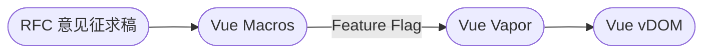

# Vue Vapor：重新发明

<div v-click op80 font-smiley>

## 🚀 探索无虚拟 DOM 的 Vue

<p op80 mt4="!">Exploring Vue without Virtual DOM</p>

</div>

<div abs-br mr-10 mb-10 flex scale-120 opacity-80>
  <div flex flex-col items-center justify-center gap1>
    
    <div text-sm>2024-07-06</div>
  </div>
</div>

<!--
哈喽大家好，很高兴这次能和大家一起在 VueConf 见面。这也是我第一次在线下和大家分享，希望大家喜欢。
我这次分享的主题是《Vue Vapor：重新发明》

[click] 本次演讲我们将一起来探索无虚拟 DOM 的 Vue。
内容会比较硬核，但也有一些轻松部分。
-->

---
layout: intro
growSeed: 15
growOpacity: 0.3
class: p-20
---

# 三咲智子 <sup opacity-80 font-hand text-4xl>Kevin Deng</sup>

<div class="[&>*]:important-leading-10 opacity-90">

作者 {Vue Vapor} / {Vue Macros} / {Elk}<br>
核心团队成员 {Vue} / {VueUse}<br>
维护者 {Unplugin}<br>

</div>

<div my-10 w-min flex="~ gap-1" items-center justify-center op85>
  <div i-ri-github-line op50 ma text-xl />
  <div><a href="https://github.com/sxzz" target="_blank" border-none="!">sxzz</a></div>

  <div i-ri-twitter-line op80 ma text-xl ml4 text="#1DA1F2" />
  <div><a href="https://twitter.com/sanxiaozhizi" border-none="!" target="_blank">sanxiaozhizi</a></div>

  <div i-ri-bilibili-line op80 ma text-xl ml4 text="#20B0E3" />
  <div><a href="https://space.bilibili.com/24679024" target="_blank" border-none="!" text-nowrap>三咲智子</a></div>
</div>


<!--
首先先来做一下自我介绍！我是 Vue Vapor、Vue Macros 和 Elk 的作者。
也是 Vue、VueUse 的核心团队成员之一。可能是最年轻的 Vue 核心成员。
同时还在维护 Unplugin 等项目。

如果你对我感兴趣，可以在 GitHub、Twitter （也就是现在的 X），或者在 Bilibili 上关注我。
我偶尔会在 B 站上直播写代码。

我是在前年加入 Vue 团队的，现在主要是在维护 Vue 相关生态的项目，也会在 GitHub 上做一些自己感兴趣的东西（比如说前端工具链）。
-->

---
layout: statement
growHide: 'true'
---

## 👂 听过 Vue Vapor 吗？

<section flex items-center justify-around mt="-14">
  
  <Analysis v-click v-if="$slidev.nav.currentPage === 3 || $slidev.nav.currentPage === 4" scale-70 />
</section>

<!--
好，我们进入正题

[click] 首先来做个投票调查，现场有多少人之前听过 Vue Vapor? 有多少人尝试过跑 Demo？或者甚至贡献过 Vapor？
我们这有个二维码，各位可以扫一扫，投个票

TODO live data
-->

---
layout: statement
grow: right
---

## 🙋 为什么叫 Vapor ？


<!--
可能有人会好奇，为什么叫 Vue Vapor？

[click] Vapor 的中文是蒸汽。我们希望 Vue Vapor 能够更轻量，更快速，更灵活。
就像蒸汽一样，是个寓意

当然 Vapor 的灵感来源于一个叫做 Solid 的框架，Solid 是固体的意思。
我们也希望 Vapor 能够成为 Vue 版本的 Solid。
-->

---
layout: statement
---

<div transition transition-500
  :class="$clicks > 0 && 'translate-y--40 scale-60 op80'">
  <div transition transition-500 ease-in-out font-fast text-6 mb2 :class="$clicks > 0 ? 'op70' : 'op0'">What's Vue Vapor?</div>
  <h1>Vue Vapor 是什么？</h1>
</div>

<div transition transition-500 text-xl font-semibold mt--10>
  <h1 v-click ma>全新的渲染机制</h1>
  <div v-click absolute top-58 left-70>无虚拟 DOM</div>
  <div v-click absolute top-58 left-113>提升性能</div>
  <div v-click absolute top-58 left-148>减少包体积</div>
  <div v-click absolute top-89 left-85>基于响应性 <code>@vue/reactivity</code></div>
</div>

<!--
好，那么 Vue Vapor 到底是什么呢？

[click] Vue Vapor 是一种全新的渲染机制。那有什么特点？或者我们想达到什么目标？

[click] 首先，它不再需要虚拟的 vDOM，而是直接操作 DOM API。

[click] 这样可以减少很多开销，提高性能，占用更少的内存。

[click] 同时减少包体积，直接使用 DOM API 可以减少代码量。比如说 vDOM diff 相关的代码。

[click] 基于 `@vue/reactivity` 响应性系统，可以精确地追踪数据的变化，
做到哪里需要更新就更新哪里，而不是整个组件重新渲染，前后对比 vDOM 更新。

以上都是我们想要达到的目标。
-->

---
clicks: 7
grow: right
---

<h1>原理 <sup text-5 op60 font-fast>mechanism</sup></h1>

Vue Vapor 基于 `@vue/reactivity` 响应性系统，通过追踪数据的变化来更新 DOM。

<div v-click="1" mt-4>

````md magic-move {lines: true, at:2}
```ts {all|1-5,18-19|7-16|all}
// 初始化
const container = document.createElement('div')
const label = document.createElement('h1')
const button = document.createElement('button')
button.textContent = 'Increase'

button.addEventListener('click', increase) // 注册事件
let count = 0
const render = () => {
  label.textContent = `Count: ${count}`
}
function increase() {
  count++
  render() // 重新渲染
}
render() // 首次渲染

document.body.append(container)
container.append(label, button)
```

```ts {1,10-18}
import { ref } from '@vue/reactivity'

// 初始化
const container = document.createElement('div')
const label = document.createElement('h1')
const button = document.createElement('button')
button.textContent = 'Increase'

button.addEventListener('click', increase) // 注册事件
const count = ref(0)
const render = () => {
  label.textContent = `Count: ${count.value}`
}
function increase() {
  count.value++
  render() // 重新渲染
}
render() // 首次渲染

document.body.append(container)
container.append(label, button)
```

```ts {1,11-16|all}
import { effect, ref } from '@vue/reactivity'

// 初始化
const container = document.createElement('div')
const label = document.createElement('h1')
const button = document.createElement('button')
button.textContent = 'Increase'

button.addEventListener('click', increase) // 注册事件
const count = ref(0)
effect(() => {
  label.textContent = `Count: ${count.value}`
})
function increase() {
  count.value++
}

document.body.append(container)
container.append(label, button)
```
````

</div>

<!--
接下来我来详细的讲解一下 Vue Vapor 的原理。不用担心过于复杂，我们会一步一步来看。

[click] 假设我们现在从头开始做一个计数器 App，不使用任何框架，只用原生的 DOM API。

[click] 首先我们创建一个 div，一个 h1 和一个 button，最后把它们添加到页面上。

[click] 我们定义一个 `count` 变量，然后给 button 添加一个点击事件，每次点击后 `count` 加一，
最后调用 `render` 函数重新把 count 渲染到页面上。

[click] 这就是一个基础的计数器 App 的实现。好像也不是很难对吧？就是写起来会麻烦点

现在我们如果引入 `@vue/reactivity`，我们可以把 `count` 变成响应式的。
[click] 我们只需要把 `count` 拿 `ref` 包一下，然后在 `increase` 函数里面改成 `count.value++`。
但这样做还是没有什么好处，我们仍然需要手动调用 `render` 函数来更新页面。

[click] 我们可以使用 `effect` 函数，把 `render` 函数放到 `effect` 里面。
这样 `render` 函数会在它依赖了的 ref，也就是 `count` 变化的时候自动调用。

[click] 这个 demo 只有一个 increase，但是如果还有 decrease 之类，很多个地方都需要考虑重新渲染。而且如果无脑全部重新渲染整个页面，性能也不太好。

有了响应性，就不必担心哪里可能需要更新，更不会忘了手动调用 `render` 了。

这基本上就是 Vue Vapor 最基础的原理。总结一下：我们使用 `@vue/reactivity` 来追踪数据的变化，
然后在数据变化的时候自动调用 `render` 来更新某个需要更新的 DOM 节点。
-->

---
layout: two-cols
grow: right
growOpacity: 1
---

<h1>Vapor SFC 编译 <sup text-5 op60 font-fast>compilation</sup></h1>

<div mt5 mr5>

```vue {all|1|all}
<script setup vapor>
import { ref } from 'vue'

const count = ref(0)

function incrase() {
  count.value++
}
</script>

<template>
  <h1>Count: {{ count }}</h1>
  <button @click="incrase">Incrase</button>
</template>
```

</div>

::right::

<div v-click="2" mt5>

<!-- prettier-ignore-start -->
```js {all|5-7|11-14|16-21|all}
import { delegate, delegateEvents, renderEffect, setText,
         template } from 'vue/vapor'
import { ref } from 'vue'

const t0 = template('<h1>')
const t1 = template('<button>Incrase')
delegateEvents('click')

export default {
  setup() {
    const count = ref(0)
    function incrase() {
      count.value++
    }

    const n0 = t0()
    const n1 = t1()
    delegate(n1, 'click', () => incrase)
    renderEffect(() => setText(n0, 'Count: ',
                               count.value))
    return [n0, n1]
  },
}
```
<!-- prettier-ignore-end -->

</div>

<!--
接下来看看 Vapor SFC 编译例子，SFC 也就是 .vue 文件。我们可以看到，它和 vDOM 模式的 SFC 文件几乎一样

[click]  只是 script 标签多了一个 vapor 属性。表明它是一个 Vapor 组件。

[click] 这是 SFC 编译后的代码，我们来一步步看一下。

[click] 首先它会把模板编译成一个个的模板片段，然后把事件代理到根节点上。
这样可以减少事件监听器的数量，优化性能。

[click] 然后我们在 setup 里面定义了 count 和 incrase 函数

[click] 最后几行代码就是核心的渲染逻辑了。
我们把事件处理函数绑定节点上，然后用 `renderEffect` 来追踪数据的更新。

[click] 值得一提的是，渲染和 setup 中的代码一样，只会执行一次。
只有需要更新的时候，才会重新执行 `renderEffect` 中的代码。
在 vDOM 模式中，每次数据变化都会重新执行一整个 render 函数，然后对比 vDOM，再做实际的更新。
-->

---
class: text-center
---

<div op60 font-fast>bundle size</div>
<h1>包体积</h1>

<div v-click mt30>
  <template v-if="$clicks === 1">
    <AnimateNumber v-slot="{ number, target }" :value="26.95" :duration="500">
      <div text-7xl font-mono font-bold text-gradient :style="{ transform: `scale(${1 + (number / target / 4)})` }">{{ number.toFixed(1).padStart(4, '0') }}%</div>
    </AnimateNumber>
    <div op80 mt-7 text-2xl flex gap1 items-center justify-center>
      <div scale-120 i-ri:arrow-down-double-line animate-pulse animate-duration-1000  />
      比 vDOM 模式减少
    </div>
  </template>
</div>

<!--
之前提到了 Vapor 可以减少包体积，那到底有多少呢？

[click] 目前 Vapor 的包体积比 vDOM 模式减少了 26.95%。大概是 1/4 左右。
-->

---
clicks: 3
class: text-center
---

<div op60 font-fast>performance</div>
<h1>性能</h1>
 1 && 'scale-240', $clicks === 2 && 'translate-y-75', $clicks === 3 && 'translate-y--90']"
/>

<!--
再来看看 Vapor 的性能如何

[click] 这是 Vapor 与 Solid、Svelte 和 Vue 3 vDOM 模式的性能图，跑的是 js-framework-benchmark 的基准测试。

[click] 我们可以看到 Vapor 目前还是不如 Solid 和 Svelte，但是比 Vue 3 vDOM 模式要快。

[click] 以纯 JS 为基准，Solid 是它的 1.09 倍，Svelte 是 1.11 倍，Vapor 是 1.24 倍
，Vue vDOM 是 1.32 倍，React 则是 1.55 倍。
虽然 Vapor 已经比 Vue vDOM 和 React 快了，但是还有非常大的提升空间，我们会持续优化。
-->

---

<h1>🤔 怎么变快？ <sup text-5 op60 font-fast>faster</sup></h1>

怎么搞？

<v-clicks mt30 text-xl>

- 打磨渲染逻辑

- 丢掉包袱，重装上阵！

</v-clicks>

<!--
刚刚说 Vapor 还有提升空间，那么我们要怎么变快和变小呢？

[click] 首先我们会继续打磨渲染逻辑，优化性能。因为目前以开发优先级来说，功能实现是优先于性能优化的。

也就是是说，我们还没有做一些优化，比如减少不必要的响应性系统的开销。

[click] 其次，我们会丢掉一些包袱，做减法！

Vapor 现在是朝着 vDOM 的测试集来做的。但是有的时候完全和 vDOM 一致并不是最好的选择。
所以我们会先实现与 vDOM 一致的行为，然后再考虑怎么减少一些不必要的功能，尤其是对性能有较大影响的功能。
-->

---
layout: statement
---

<div transition transition-500 ease-in-out :class="$clicks > 0 && 'translate-y--30'">
  <div transition transition-500 ease-in-out font-fast text-4 mb2 :class="$clicks > 0 ? 'op70' : 'op0'" line-through>breaking changes</div>
  <h1 transition transition-500 ease-in-out v-mark.red.linethrough="1" w-fit ma="!" :class="$clicks === 1 && 'op80 scale-80'">破坏性变动</h1>
</div>

<h1 v-click transition transition-500 :class="$clicks > 0 && 'scale-150'">🙅<br>No!</h1>

<!--
那是不是意味着，Vapor 将有破坏性变动呢？

[click] 这个说法并不正确！Vapor 的目标会是 vDOM 模式的子集
-->

---
clicks: 4
---

<h1>子集 <sup text-5 op60 font-fast>subset</sup></h1>

Vue Vapor 是 Vue vDOM 模式的子集。

<v-clicks at="2" class="[&>li]:mb-5" mt15>

- 放弃：Options API
  - 或许会作为第三方库？
- 放弃：直接通过 CDN 使用
  - 需要构建工具编译 (Vite / Webpack...)
- 放弃：在 `<script>` 导出组件
  - 只支持 `<script setup>`

</v-clicks>

<div
  v-click="1"
  absolute w-120 h-120 left-110 top-10 border="~ green rounded-full"
  bg-green:20 text-3xl text-green flex="~ items-center"
>
  <div flex="~ col items-center justify-center" gap2 ml20>
    <div i-logos-vue text-6xl />
    <span font-semibold>vDOM</span>
    <ul text-sm op70>
      <li>Composition API</li>
      <li>Options API</li>
      <li>自定义指令</li>
      <li>Mixins...</li>
    </ul>
  </div>
</div>

<div
  v-click="2"
  absolute w-60 h-60 left-166 top-40 border="~ blue/50 rounded-full"
  bg-blue:10 text-2xl text-blue-200 flex="~ gap-3 items-center justify-center"
  transition-all duration-500 ease-in-out
  :class="$clicks >= 2 ? '' : 'scale-0'"
>
  <div flex="~ col items-center justify-center" gap2>
    <div text-2xl>✌️</div>
    <span font-semibold>Vapor</span>
    <ul text-sm op70>
      <li>Composition API</li>
      <li><code>&lt;script setup&gt;</code></li>
    </ul>
  </div>
</div>

<!--
如何理解它是子集呢？

[click] 首先，我们可以看到目前的 Vue vDOM 模式有很多功能，比如 Options API、Composition API、自定义指令、Mixins 等等。

[click] 而 Vapor 目前打算放弃支持 Options API，只支持 Composition API。
但后续根据反馈，我们可能会让 Options API 作为第三方库提供。

[click] Vapor 不打算支持直接跑在者浏览器使用，比如说引入 CDN 中的文件。
而是需要通过构建工具编译后才能使用。

这是因为 Vapor 的编译器较为复杂，需要借助像 Babel 这种第三方工具。
如果把编译器放到浏览器里面跑，降低了性能，增加了包体积，还不如继续用 vDOM 模式。

[click] 最后呢，Vapor 只支持 `<script setup>`，不支持在普通的 `<script>` 导出组件。
`<script setup>` 是 Composition API 的最佳实践，放弃了 Options API 支持后，
编译器可以更好地优化代码。
-->

---

<h1>兼容性 <sup text-5 op60 font-fast>compatibility</sup></h1>

<v-clicks>

- {VueUse}

- {VitePress}
- {Vue Router} <span op80> / Pinia</span>
- {Nuxt}
- UI 库
  - Naive UI / Element Plus / Vuetify...
- {Elk}
- <span v-mark.red.linethrough="8">Vue 2</span>

</v-clicks>

<!--
我们再来看看兼容性方面

[click] Vapor 目前兼容大部分的 VueUse 函数。

得益于 Vapor 的响应性系统和 Vue 3 的响应性系统是完全一致的。
除了一些和组件相关的，其他都可以直接使用。

[click] Vapor 会在第一时间兼容 VitePress、
[click] Vue Router、Pinia 等官方项目
[click] Nuxt 也会在未来支持 Vapor

[click] UI 库方面，像 Naive UI、Element Plus、Vuetify，我们也会协助社区做适配。
这个适配成本不会像 Vue 2 到 Vue 3 那么高，因为 Vapor 和 vDOM 模式的用户侧 API 是一致的。

[click] 我们社区的项目 Elk 也会在未来支持 Vapor。Elk 可以视为 Vue 和 Nuxt 的最佳实践。

[click] 那 Vue 2 会不会支持 Vapor 呢？[click] 并不会支持，Vue 2 已经在今年停止维护了。
所以我们不会在 Vue 2 上做任何新的特性支持。
-->

---

<h1 important-mb10>进度 <sup text-5 op60 font-fast>progress</sup></h1>

- ✅ SFC 编译
- ✅ [基础组件能力](https://github.com/vuejs/core-vapor/issues/197)
  - 内置指令
  - 生命周期钩子
  - ...

<div mt4 v-click>

- 🚧 性能调优
- 🚧 SSR / 水合 (hydration)
- 🚧 DevTools
- 🚧 异步组件
- 🚧 内置组件

</div>

<v-click>

- {VitePress} 将会在今年底支持，并发布 beta 版

</v-click>

<!--
目前的进度如何呢？

目前我们已经完成了大部分的基础功能，比如 SFC 编译、各种指令、生命周期钩子等等。
刚刚的投票的那个页面，也是用 Vapor 实现的。

[click] 接下来我们会继续优化性能、支持 SSR 和水合（hydration）、适配 DevTools、支持异步组件和完善内置组件等等。

[click] 我们计划 Vapor 在今年底适配 VitePress，然后发布第一个 beta 版本
-->

---
class: text-center
---

# DevTools

<div flex w-full items-center justify-center gap2>
  <div op80>感谢 Vue DevTools 团队</div>
  
  <a op80 href="https://github.com/webfansplz" target="_blank">webfansplz</a>
</div>


<!--
说到 DevTools，目前 Vapor 已经部分支持 Vue DevTools 了。感谢 Vue DevTools 团队的支持！
-->

---
layout: fact
clicks: 1
---

<h1>
支持 JSX
<span transition transition-500 :class="$clicks > 0 && 'op0'">?</span>
</h1>

<!--
也有人关心 Vapor 会支持 JSX 吗？[click] 答案是会支持 JSX。并且会比 vDOM 模式有更好的支持。

未来我们可能会直接在 Vue 的核心库中做支持。这得益于 Vapor 编译器的架构更加灵活，更容易支持 JSX。
-->

---
clicks: 6
---

<!-- Made by @LittleSound, thanks to her! -->
<h1>架构 <sup text-5 op60 font-fast>architecture</sup></h1>
<!-- TODO native support -->
<v-click>
  <div class="architecture text-xs mt--8">
    <div
      relative w-full rounded-lg shadow-lg text-white p="t-8 b-2"
      transition="all duration-500 ease-in-out"
      :class="[$clicks >= 4 ? 'px-30' : 'px-60']"
    >
      <!-- 上层的方框 -->
      <div class="grid grid-cols-2 gap-y-2 gap-x-3 mb-2">
        <div
          class="border-1 border-white bg-gray/40 p-1 rounded"
          transition="all duration-500 ease-in-out"
          :class="[
            ([0,1,2,4].includes($clicks)) ? 'op-100' : 'op-50',
            ($clicks >= 4 ? 'col-span-1' : 'col-span-2'),
          ]"
        >
          <p text="$text-secondary" font-mono>@vitejs/plugin-vue</p>
          <p text-sm w-full flex items-center>
            <span inline-block i-ri-arrow-down-fill />
            <span>Call</span>
          </p>
        </div>
        <div
          v-click="4"
          class="border-1 border-white bg-gray/40 p-1 rounded text-right"
          transition="all duration-500 ease-in-out"
          :class="[
            $clicks >= 6 ? 'op-50' : 'op-100',
            $clicks >= 4 ? 'block' : '!hidden',
          ]"
        >
          <p text="$text-secondary" font-mono>unplugin-vue-jsx-vapor</p>
          <p text-sm w-full flex items-center justify-end>
            <span>Call</span>
            <span inline-block i-ri-arrow-down-fill />
          </p>
        </div>
        <div
          class="border-1 border-white bg-gray/40 p-1 rounded"
          transition="all duration-500 ease-in-out"
          :class="[
            ([0,1,2,4].includes($clicks)) ? 'op-100' : 'op-50',
            ($clicks >= 4 ? 'col-span-1' : 'col-span-2'),
          ]"
        >
          <p text="$text-secondary" font-mono>@vue/compiler-sfc</p>
          <p text-sm w-full flex items-center>
            <span inline-block i-ri-arrow-down-fill />
            <span>Call</span>
          </p>
        </div>
        <div
          class="border-1 border-white bg-gray/40 p-1 rounded text-right" op-0
          transition="all duration-500 ease-in-out"
          :class="[$clicks >= 4 ? 'block' : '!hidden']"
        >
          <!-- @vue/jsx-vapor 占位符 -->
          <p font-mono>@vue/jsx-vapor</p>
          <p>JSX ➡️ IR</p>
        </div>
      </div>
      <!-- 中间的方框 -->
      <div
        class="border-1 border-white bg-gray/40 p-1 rounded mb-6"
        :class="([2,5].includes($clicks)) ? 'op-50' : 'op-100'"
      >
        <div mb-2>
          <p text="$text-secondary" font-mono>@vue/compiler-vapor</p>
          <p
            text-sm
            transition="all duration-500 ease-in-out"
            :class="([6].includes($clicks) ? 'op-20' : 'op-100')"
          >
            <p>SFC <span inline-block relative top-0.5 i-ri-arrow-right-fill /> JS Code</p>
          </p>
        </div>
        <div grid grid-cols-2 gap-y-2 gap-x-3>
          <!-- @vue/compiler-vapor -->
          <div
            grid grid-cols-1 gap-2
            :class="[
              ($clicks >= 4 ? 'col-span-1' : 'col-span-2'),
              ([6].includes($clicks) ? 'op-20' : 'op-100'),
            ]"
            transition="all duration-500 ease-in-out"
          >
            <div class="border-1 border-white p-1 rounded">
              <p text="$text-secondary" font-mono>[Parse]</p>
              <p text-sm><p>SFC <span inline-block relative top-0.5 i-ri-arrow-right-fill /> AST</p></p>
            </div>
            <div class="border-1 border-white p-1 rounded">
              <p text="$text-secondary" font-mono>[Transform]</p>
              <p text-sm><p>SFC AST <span inline-block relative top-0.5 i-ri-arrow-right-fill /> IR</p></p>
            </div>
          </div>
          <!-- @vue/jsx-vapor -->
          <div
            border-1 border-white text-right mt="-24.75" mb="-1" mr="-1" p-1 rounded flex flex-col gap-2
            shadow overflow-hidden
            v-click="4"
            transition="all duration-500 max-height-500 ease-in-out"
            :class="[
              ($clicks >= 4 ? 'flex' : '!hidden'),
              ($clicks === 5 ? 'op-50' : 'op-100'),
              ([6].includes($clicks) ? 'max-h-200 bg-gray/20 backdrop-blur-md !duration-2000' : 'max-h-11 bg-gray/50'),
            ]"
          >
            <div>
              <p text="$text-secondary" font-mono>@vue/jsx-vapor</p>
              <p text-sm><p>JSX <span inline-block relative top-0.5 i-ri-arrow-right-fill /> IR</p></p>
            </div>
            <div flex-1 />
            <div grid grid-cols-1 gap-2>
              <div class="border-1 border-white p-1 rounded">
                <p text="$text-secondary" font-mono>[Parse]</p>
                <p text-sm>JSX <span inline-block relative top-0.5 i-ri-arrow-right-fill /> AST</p>
              </div>
              <div class="border-1 border-white p-1 rounded">
                <p text="$text-secondary" font-mono>[Transform]</p>
                <p text-sm>JSX AST <span inline-block relative top-0.5 i-ri-arrow-right-fill />  IR</p>
              </div>
            </div>
          </div>
          <div
            class="border-1 border-white p-1 rounded" col-span-2
            transition="all duration-500 ease-in-out"
            :class="[
              (($clicks === 6) ? 'text-right' : 'text-left'),
              (($clicks < 4 | $clicks === 6) ? 'w-full' : 'w-[49%] !duration-0'),
            ]"
          >
            <p text="$text-secondary" font-mono>[Generate]</p>
            <p text-sm>IR <span inline-block relative top-0.5 i-ri-arrow-right-fill />  JS Code</p>
          </div>
        </div>
      </div>
      <div w-full h-4 />
      <!-- 底部的方框 -->
      <div
        class="border-1 border-white bg-gray/40 p-1 rounded"
        transition="all duration-500 ease-in-out"
        :class="[
          (($clicks === 5 || $clicks === 2) ? 'op-50' : 'op-100'),
          (($clicks === 6) ? 'text-right' : 'text-left'),
        ]"
      >
        <p text="$text-secondary">JS Code</p>
        <p text-sm>Final Product｜最终产物</p>
      </div>
      <!-- 箭头 -->
      <div>
        <!-- SFC -->
        <div
          absolute inset-y-0 w-10 translate-x="-1/2" flex="~ col" border="$color-sfc" pb-16
          transition="all duration-500 ease-in-out"
          :class="[
            ($clicks >= 1 ? 'translate-y-0' : 'translate-y--100'),
            ($clicks >= 4 ? 'left-8/20' : 'left-10/20'),
            (($clicks >= 5) ? 'op-20' : 'op-100'),
          ]"
        >
          <div font-mono flex-1 text-center p-1 w-full border-4 border-b-none border="$color-sfc" rounded-t>
            SFC
          </div>
          <div ml="-2" w-14 flex>
            <div w-2 border-t-4 border="$color-sfc" rounded-tl />
            <div w-1.5 border-t-4 border="$color-sfc" rounded-br />
            <div w-10 />
            <div w-1.5 border-t-4 border="$color-sfc" rounded-bl />
            <div w-2 border-t-4 border="$color-sfc" rounded-tr />
          </div>
          <div w-10 h-10 mt="-5" border-b-4 border-r-4 border="$color-sfc" rotate-45 rounded-br />
        </div>
        <!-- JSX -->
        <div
          v-click="4"
          absolute inset-y-0 w-10 left="12/20" translate-x="-1/2" flex="~ col" border="$color-jsx" pb-16
          transition="all duration-500 ease-in-out"
          :class="($clicks >= 4 ? 'translate-y-0' : 'translate-y--100')"
        >
          <div font-mono flex-1 text-center p-1 w-full border-4 border-b-none border="$color-jsx" rounded-t>
            JSX
          </div>
          <div ml="-2" w-14 flex>
            <div w-2 border-t-4 border="$color-jsx" rounded-tl />
            <div w-1.5 border-t-4 border="$color-jsx" rounded-br />
            <div w-10 />
            <div w-1.5 border-t-4 border="$color-jsx" rounded-bl />
            <div w-2 border-t-4 border="$color-jsx" rounded-tr />
          </div>
          <div w-10 h-10 mt="-5" border-b-4 border-r-4 border="$color-jsx" rotate-45 rounded-br />
        </div>
      </div>
    </div>
  </div>
  <p text-xs relative text-right top="-2" text="$text-secondary">IR = 中间语言 ｜ AST = 抽象语法树 ｜ SFC = 单文件组件 ｜ JSX = JavaScript XML 语法</p>
</v-click>

<!--
h
-->

---

# interop

TODO

---

<h1>功能规划 <sup text-5 op60 font-fast>feature plan</sup></h1>

<div overflow-hidden transition-width transition-500 mt20
     :class="[$clicks === 0 && 'w-0', $clicks === 1 && 'w-60.4', $clicks === 2 && 'w-98.93', $clicks === 3 && 'w-157.9', $clicks === 4 && 'w-full']">



</div>

<div mt15>
<v-clicks>

1. 提出 RFC 意见征求稿

2. Vue Macros 第三方项目先试验
3. 以 Feature Flag 的形式引入 Vue Vapor
4. 移植到 Vue vDOM

</v-clicks>
</div>

<style>
.mermaid {
  text-align: center;
  width: 55rem;
}
</style>

<!--
关于未来的新功能规划，我们的计划是
- [click] 首先如果团队或者社区有新的功能，会先提出 RFC 意见征求稿。
- [click] 我们可能会先在 Vue Macros 第三方项目实现这个功能，然后继续等待更多的反馈。
- [click] 如果这个功能通过了，之后会以 Feature Flag 的形式引入 Vue Vapor。
feature flag 就是一个开关，可以在 Vue 项目中打开或关闭某个功能。

- [click] 最后再移植到 Vue vDOM 中。

也就是说，Vapor 将比 vDOM 快一步，首先尝试新的功能。因为 Vapor 没有什么历史包袱。
这样的流程可以让我们更好地控制新功能的风险，社区也可以更好地参与到 Vue 的发展中。这是目前计划的 Vue 3 发展模式。

至于 Vue 4，我们充分吸取了 Vue 2 到 Vue 3 的教训，我们会以先在 minor 中版本中引入新的 feature flag，然后再在 Vue 4 中废弃掉或改变它的默认值。但是目前没有计划 Vue 4 的发布，可能需要等待 feature flag 达到一定数量后才会考虑。
-->

---

<h1>总结 <sup text-5 op60 font-fast>recap</sup></h1>

<div mt20>
<v-clicks>

- Vapor 是 Vue 的一个新的开始

- Vapor 是 Vue vDOM 模式的子集，尝试做减法
- Vapor 会持续优化性能和包体积
- Vapor 将有更好的 JSX 支持
- Vapor 会在今年底发布 beta 版，并支持 {VitePress}

</v-clicks>
</div>

<!--
总结一下（读PPT）
-->

---
growOpacity: 0.5
growSeed: 2
class: text-center
---

<div op60 font-fast>contributors</div>

# 贡献者

<div flex items-center justify-center gap1 op70>
  <div i-ri:github-fill />
  <a href="https://github.com/vuejs/core-vapor" target="_blank">github.com/vuejs/core-vapor</a>
</div>

<div flex justify-around items-center mt20>
  <GitHub v-click id="yyx990803" label="Vue 作者" name="Evan You" />
  <GitHub v-click transition transition-400 ease-out
          :class="$clicks < 2 && 'translate-x-10'"
          id="sxzz" label="Vue Vapor 作者" name="Kevin Deng" />

<GitHub v-click="3" transition transition-400 ease-out
          :class="$clicks < 3 && 'translate-x-10'"
          id="LittleSound" label="活跃开发者" name="Rizumu Ayaka" />
<GitHub v-click="3" transition transition-400 ease-out
          :class="$clicks < 3 && 'translate-x-10'"
          id="Ubugeeei" label="活跃开发者" />
<GitHub v-click="3" transition transition-400 ease-out
          :class="$clicks < 3 && 'translate-x-10'"
          id="doctor-wu" label="活跃开发者" name="Doctor Wu" />

</div>

<!--
在这同样要感谢一下 Vue Vapor 的贡献者们

[click] 特别是 Evan You，第一版的 Vapor 就是 Evan 写的，现在也在做重要的设计和决策。

[click] 然后就是我自己，我目前负责 Vapor 的维护和开发。

[click] 还有一些活跃的贡献者，比如小音、Ubugeeei
和 Doctor Wu 等等，和 PPT 上没有提及到的社区贡献者。

同时需要再次感谢一下小音和 Doctor Wu，本次 PPT 也离不开他们的帮助！
-->

---
class: text-center
---

<div op60 font-fast>sponsors</div>

# 赞助

<div flex items-center justify-center gap1 op70 mb2>
  <div i-ri:heart-3-fill text-pink />
  <a href="https://github.com/sponsors/sxzz" target="_blank">github.com/sponsors/sxzz</a>
</div>

<a href="https://github.com/sponsors/sxzz" target="_blank">
  
</a>

<!--
最后，感谢所有赞助我的人，你们的支持是我继续开发的动力。

如果你也想加速 Vapor 的发展，可以在 GitHub 上赞助我和其他的活跃开发者。
-->

---
layout: intro
class: text-center
growOpacity: 0.7
growSeed: 1
---

<h1 font-smiley scale-120>感谢</h1>

<div op80 font-smiley text-5>

幻灯片可稍后在 <ri-github-fill /> [github.com/sxzz/talks](https://github.com/sxzz/talks) 浏览

</div>

<div font-smiley text-4>
  💖
  <span op70>感谢
    <a href="https://github.com/antfu" target="_blank">Anthony Fu</a>，
    幻灯片由  <a href="https://sli.dev/" target="_blank"> Slidev</a>
    强力驱动！
  </span>
</div>

<style>
a {
  border: 0 !important
}
</style>

<!--
最后，今天我的分享就到这里了。
如果大家对 Vue Vapor 有兴趣，可以在 GitHub 上关注 Vue Vapor 的进展。

也需要大力感谢一下 Slidev 的作者 Anthony Fu，没有他的模板就没有这么好看的 PPT！
感谢大家，下面是 Q&A 环节。
-->

---
layout: fact
---

# Q & A

<!--
- Rust compiler

感谢大家，下次见！
-->
